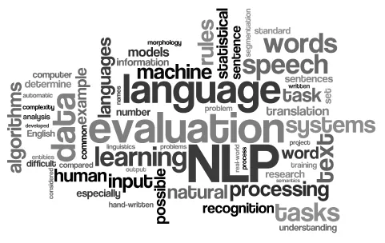

# NLP_SentimentAnalysis

    

## DataSet
The Dataset consists of reviews of fine foods from Amazon. Reviews Include rating, user information, plaintext, etc.
The data was acquired over a period of more than 10 years(~500,000 Observation), but in this project, for the sake of speed, we analyze 500 observation.

# Vader Model, Roberta Model
We apply two different models for Sentiment Analysis (Vader and Roberta model) for reviewing the comments on Amazon's fine food dataset.
We Explored the differences between them and ran them on a whole corpus of data with 500 different reviews from Amazon.

# What is Sentiment Analysis?
Sentiment analysis is the process of classifying the emotional intent of the text. Generally, the input to a sentiment classification model is a piece of text, and the output is the probability that the sentiment expressed is positive, negative, or neutral. Sentiment analysis is used to classify customer reviews on various online platforms.

